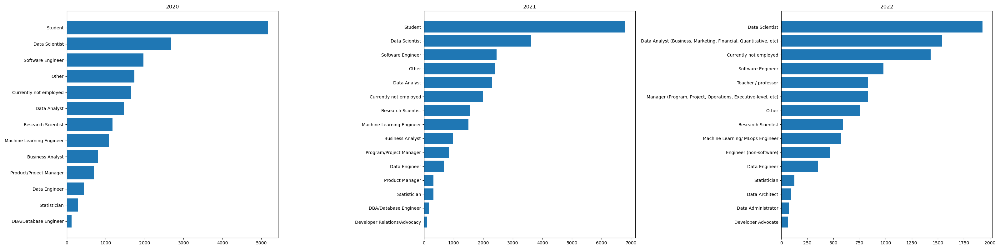
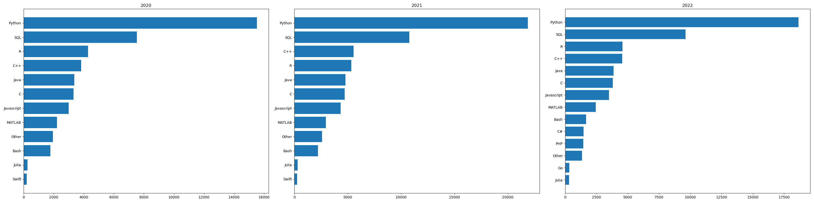

# 練習專案三：資料科學家的工具箱

## 簡介
這個專案「資料科學家的工具箱」透過 2020、2021 與 2022 年 [kaggle.com](https://www.kaggle.com) 所舉辦的 Kaggle Machine Learning and Data Science Survey 普查問卷進行縱貫研究，針對下列三個常見初學者問題進行探索性分析。

1. 從事資料科學工作的職缺抬頭（title）有哪些？
2. 從事資料科學工作的日常內容是什麼？
3. 想要從事資料科學工作，需要具備哪些技能與知識？

我們使用了 `pandas` 與 `sqlite3` 建立了資料庫，利用 `matplotlib` 進行概念驗證並做出成品。

## 如何重現
安裝 [Miniconda](https://www.anaconda.com/docs/getting-started/miniconda/main)
依據 environment.yml 建立環境：
```bash
conda env create -f environment.yml
```
將 `data/` 資料夾中的 `kaggle_survey_2020_responses.csv`, `kaggle_survey_2021_responses.csv`, `kaggle_survey_2022_responses.csv` 置放於工作目錄中的 `data/` 資料夾。
啟動環境並執行 `python create_kaggle_survey_db.py` 就能在 `data/` 資料夾中建立 kaggle_survey.db
啟動環境並執行 `python create_longitudinal_analysis_plots.py `就能輸出六組水平長條圖。

### 從事資料科學工作的職缺抬頭（title）有哪些？

Data scientist, Data analyst, Software engineer,...ect.
- 這張圖顯示了受訪者在 2020 至 2022 年之間所選擇的職位名稱。整體來看，可以觀察到幾個有趣的趨勢變化：
    1. 學生（Student）人數最多，但逐年下降
        - 2020 年有超過 5,000 人自認為是學生，到 2022 年下降至約 1,900 人。
        - 可能反映 Kaggle 使用者中職場新手的比例正在減少，或問卷觸及的族群有所改變。

    2. Data Scientist、Data Analyst 穩居前列
        - 這兩個職位在三年中皆維持高人氣，顯示該領域仍是主流。

    3. ML Engineer / MLOps Engineer 興起
        - 「Machine Learning Engineer」在 2020、2021 表現亮眼，而 2022 年出現「Machine Learning/MLOps Engineer」的新職稱，顯示 MLOps 開始受到重視。



### 從事資料科學工作的日常內容是什麼？

Analyze and understand data to influence product or business decisions.


### 想要從事資料科學工作，需要具備哪些技能與知識？

Programming Languages: Python、SQL、R、C++


Databases: MySQL、PostgreSQL、MS SQL Server...etc.


Visualizations: Matplotlib、Seaborn、Plotly...etc.


Machine: Linear/Logistic Regression、Decision Trees/Random Forests、Deep Learning、XGBoost...etc.


### 由於好奇台灣的資料，我自己做了一份關於台灣資料。
從 Kaggle 調查資料觀察可知，台灣在數據相關職能上的發展仍處於起步階段，整體從業人口相對較少，學生與初階學習者比例偏高，顯示產業尚未全面進入數據驅動的成熟階段。目前企業多以資料分析作為主要應用方向，較少涉及機器學習模型開發或資料基礎設施建置，顯示多數企業仍處於數位轉型的早期階段。整體而言，台灣的資料科學產業正逐步發展中，未來在政府政策與企業需求的推動下，仍具備成長潛力與機會。<br>
#### 從事資料科學工作的職缺抬頭（title）有哪些？
Software Engineer, Teacher / Professor, Currently not employed,Database Engineer,...ect.


#### 從事資料科學工作的日常內容是什麼？
Analyze and understand data to influence product or business decisions.


#### 想要從事資料科學工作，需要具備哪些技能與知識？
Programming Languages: Python、SQL、C++、R


Databases: MySQL、MS SQL Server、PostgreSQL...etc.


Visualizations: Matplotlib、Seaborn、Plotly...etc.


Visualizations: Linear/Logistic Regression、Decision Trees/Random Forests、Deep Learning、XGBoost...etc.


